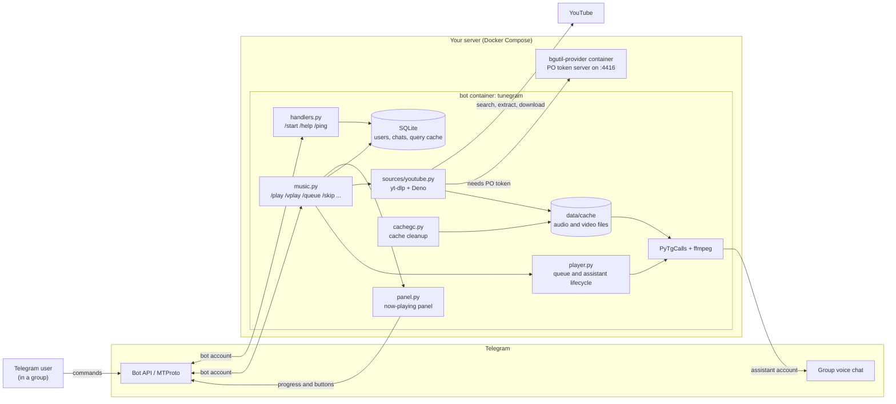
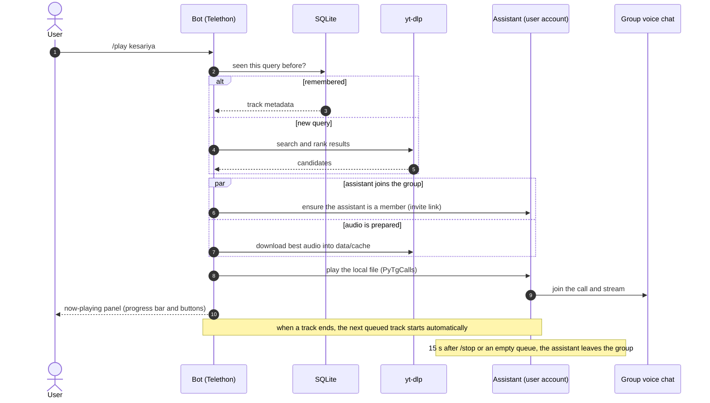
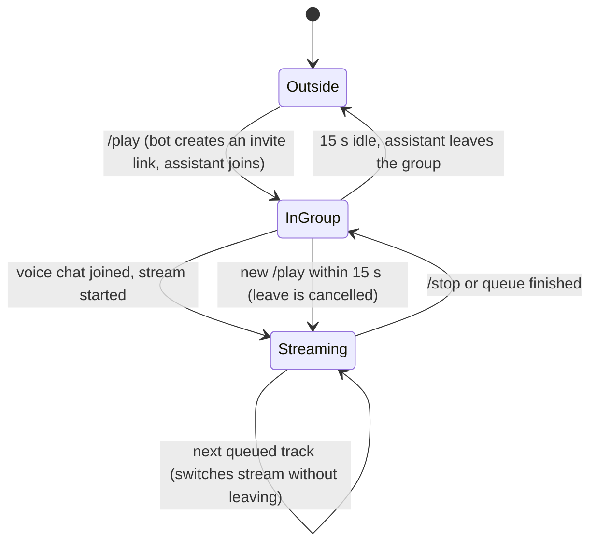

# tunegram

A Telegram music bot focused on clean, high-quality playback: fast search, smooth streaming, queue and playback controls.

Play songs and videos in group voice chats with `/play` and `/vplay`, manage a queue, and control everything from a live "now playing" panel.

> **Disclaimer:** this project is for educational and personal use. Downloading or streaming content from YouTube may violate YouTube's Terms of Service and copyright law, depending on where you live and how you use it. You are responsible for how you use this software.

---

## Table of contents

- [Features](#features)
- [How it works](#how-it-works)
- [Project structure](#project-structure)
- [Requirements](#requirements)
- [Getting started (local)](#getting-started-local)
- [Using the bot in a group](#using-the-bot-in-a-group)
- [Commands](#commands)
- [Configuration reference](#configuration-reference)
- [Run with Docker Compose](#run-with-docker-compose)
- [Deploy on AWS EC2](#deploy-on-aws-ec2)
- [Operations cheat-sheet](#operations-cheat-sheet)
- [Troubleshooting](#troubleshooting)
- [Security notes](#security-notes)
- [Development](#development)
- [Ideas / roadmap](#ideas--roadmap)
- [License](#license)

---

## Features

- **`/play`** streams audio and **`/vplay`** streams video (with sound) into the group voice chat.
- **Queue** with automatic next track, `/skip` and `/queue`. Audio and video can be mixed in one queue.
- **Live now-playing panel** with a progress bar and play / pause / skip / stop buttons. Only the button row is edited, so Telegram never shows an "edited" label.
- **On-demand assistant account:** it joins the group when you play something and leaves 15 seconds after playback ends.
- **Instant repeats:** the bot remembers which video a search query resolved to and keeps the audio on disk, so a repeated `/play` skips search, extraction and download.
- **Automatic cache cleanup** (least-recently-used files are deleted first, files in use are never touched).
- **Smart result picking:** English-titled results first, official music videos ranked above lyric videos for `/vplay`, and unavailable videos are skipped automatically by trying the next result.
- **Branded `/start` menu** with a banner and live stats (uptime, CPU, RAM, disk, users, chats).
- **Docker Compose deployment** (bot + PO token provider) with automatic restart.

---

## How it works

### Why two Telegram accounts?

Telegram **bots cannot join voice chats**. Only a real user account can stream audio into one. That is why every music bot has an "assistant" account behind it, and tunegram works the same way:

| | Bot | Assistant |
|---|---|---|
| What it is | A normal Telegram bot (created with @BotFather) | A regular Telegram **user account** (use a dedicated one) |
| Library | Telethon (bot token) | Telethon (`StringSession`) + PyTgCalls |
| Job | Receives commands, sends messages and the now-playing panel, creates invite links | Joins the group, joins the voice chat, streams audio/video |
| Visible in the group | As the bot | As a normal member, only while music is playing |

### Architecture



### What happens on `/play`



### Assistant lifecycle



### Why the audio is downloaded first

Handing a YouTube stream URL straight to ffmpeg was unreliable: depending on the YouTube client, the URL returns `403 Forbidden` or is throttled to slower than real time. So tunegram downloads the audio (about 5 MB per song) into `data/cache` with yt-dlp and streams the **local file**. Playback is stable and gapless, and replays are instant. Startup time is kept low with a PO token provider, a persistent yt-dlp session, and parallel work (the assistant joins while the audio downloads).

---

## Project structure

```
tunegram/
├── src/tunegram/
│   ├── main.py             # entry point: starts bot, assistant, panel and cache janitor
│   ├── config.py           # environment configuration
│   ├── handlers.py         # /start, /help, /ping and the start menu
│   ├── music.py            # /play /vplay /queue /skip /pause /resume /stop
│   ├── player.py           # queue, PyTgCalls playback, assistant join/leave
│   ├── panel.py            # now-playing panel with live progress bar
│   ├── db.py               # SQLite: users, chats, query cache
│   ├── stats.py            # uptime / CPU / RAM / disk for the start menu
│   ├── cachegc.py          # least-recently-used cache cleanup
│   └── sources/
│       └── youtube.py      # yt-dlp search, extraction and download
├── scripts/
│   ├── gen_session.py      # generate the assistant's session string
│   └── stream_test.py      # diagnostic: which YouTube client can be streamed directly
├── tests/
├── assets/banner.jpg       # image shown in the /start menu (optional)
├── Dockerfile
├── docker-compose.yml
├── pyproject.toml
└── .env.example
```

---

## Requirements

- Linux (developed and tested on Ubuntu 26.04 LTS)
- Python 3.10+ (the Docker image uses 3.13)
- `ffmpeg`
- [Deno](https://deno.com) (yt-dlp needs a JavaScript runtime to solve YouTube challenges)
- Docker (runs the PO token provider; also used for deployment)
- A Telegram account for API credentials, a **bot** (from @BotFather) and a **dedicated assistant account** (a separate phone number is strongly recommended)
- A throwaway Google account for YouTube cookies (not your main account)

---

## Getting started (local)

### 1. Get your Telegram credentials

1. Go to <https://my.telegram.org>, log in and open **API development tools**. Create an app and note the `api_id` and `api_hash`.
2. In Telegram, talk to **@BotFather**, send `/newbot` and note the **bot token**.
3. Prepare the **assistant account**: a separate Telegram account, ideally on its own phone number. Give it a simple name, hide its phone number and last seen (Settings, Privacy) and turn on Two-Step Verification.

### 2. Install system packages and Deno

```bash
sudo apt update
sudo apt install -y python3-venv python3-pip ffmpeg unzip git
curl -fsSL https://deno.land/install.sh | sh
```

Open a new terminal afterwards and check `deno --version`.

### 3. Get the code and install it

```bash
git clone https://github.com/sonujha78/tunegram.git
cd tunegram
python3 -m venv .venv
source .venv/bin/activate
pip install -e ".[dev]"
```

### 4. Start the PO token provider

YouTube increasingly requires a "PO token" for its stream URLs. A small provider container generates them, and yt-dlp finds it automatically through a plugin (already listed in the dependencies):

```bash
docker run --name bgutil-provider -d -p 4416:4416 --restart unless-stopped \
  brainicism/bgutil-ytdlp-pot-provider
```

### 5. Configure

```bash
cp .env.example .env
chmod 600 .env
nano .env
```

Fill in `API_ID`, `API_HASH` and `BOT_TOKEN` first. See the [configuration reference](#configuration-reference) for everything else.

### 6. Generate the assistant's session string

```bash
python scripts/gen_session.py
```

Log in with the **assistant account's** phone number and the OTP. Paste the printed string into `.env` as `SESSION_STRING=...` (use `nano`, not `echo`, so it does not end up in your shell history), then run `clear`.

### 7. Export YouTube cookies

Cookies help YouTube accept your requests instead of showing "Sign in to confirm you're not a bot".

1. Create or use a **throwaway Google account**.
2. Open a Chrome **Incognito** window (allow your cookie-export extension in Incognito) and log in to youtube.com.
3. In the same tab, open `https://www.youtube.com/robots.txt`, then export the cookies in **Netscape** format with an extension such as *Get cookies.txt LOCALLY*.
4. **Close the Incognito window immediately.** If you keep browsing, YouTube rotates the session and the exported cookies stop working.
5. Save the file:

```bash
mkdir -p data
mv ~/Downloads/www.youtube.com_cookies.txt data/cookies.txt
chmod 600 data/cookies.txt
grep -q '^YT_COOKIES_FILE=' .env || echo 'YT_COOKIES_FILE=data/cookies.txt' >> .env
```

### 8. Test the audio pipeline

```bash
python -m tunegram.sources.youtube "tum hi ho arijit singh" --play
```

You should see search results, a `Saved: data/cache/...` line, and 20 seconds of audio from your speakers. If something fails, see [Troubleshooting](#troubleshooting).

### 9. (Optional) Add a banner

Put a 1280x720 image (under 1 MB) at `assets/banner.jpg`. It is shown in the `/start` menu. Without it the bot sends plain text.

### 10. Run the bot

```bash
python -m tunegram
```

You should see `Userbot ready: ...` and `Bot started as @yourbot`. Stop it with `Ctrl+C`.

---

## Using the bot in a group

1. Open your bot's profile and tap **Add to Group**, or use the button in the `/start` menu.
2. Make the bot an **admin** with **Invite users via link** (needed so it can bring the assistant in). "Delete messages" is optional.
3. Start a **voice chat** in the group. (If you promote the assistant account to admin with **Manage video chats**, it can start the voice chat by itself.)
4. Send `/play <song name or YouTube link>`. The assistant joins, the panel appears, and you can join the voice chat from your own account to listen. Use a **different** account than the assistant, because one account cannot join the same call twice.
5. Send more `/play` commands to build a queue, or use the panel buttons.

---

## Commands

| Command | Description |
|---|---|
| `/start` | Main menu with banner, live stats and buttons |
| `/help` | List of commands |
| `/ping` | Bot latency |
| `/play <song or link>` | Play audio in the group voice chat (queued if something is playing) |
| `/vplay <video or link>` | Play a video with sound in the voice chat |
| `/queue` | Show the current track and what is next |
| `/skip` | Skip to the next track |
| `/pause` and `/resume` | Pause and resume |
| `/stop` | Stop, clear the queue and leave the call |

Limits: audio up to 60 minutes, video up to 30 minutes, 20 tracks per queue. Live streams are not supported. The panel buttons (play, pause, skip, stop) do the same as the commands.

---

## Configuration reference

All settings are environment variables, normally in `.env`.

| Variable | Required | Default | Description |
|---|---|---|---|
| `API_ID` | yes | | Telegram API ID from my.telegram.org |
| `API_HASH` | yes | | Telegram API hash |
| `BOT_TOKEN` | yes | | Token from @BotFather |
| `SESSION_STRING` | for music | | Assistant account session (`scripts/gen_session.py`). Without it the bot starts but music commands are disabled |
| `BOT_NAME` | no | `Music Bot` | Display name in the `/start` menu |
| `OWNER_NAME` | no | `Owner` | Developer name in the `/start` menu |
| `OWNER_URL` | no | | Link for the developer button, for example `https://t.me/username`. Empty hides the button |
| `SUPPORT_URL` | no | | Link for the support button. Empty hides the button |
| `YT_COOKIES_FILE` | recommended | | Path to the Netscape cookies file, for example `data/cookies.txt` |
| `CACHE_MAX_MB` | no | `1500` | Maximum size of `data/cache` before the oldest files are removed |
| `VIDEO_HEIGHT` | no | `480` | `/vplay` quality: `360`, `480` or `720`. Use `360` on small servers |

Runtime data lives in `data/` (session file, SQLite database, cookies, audio cache). It is git-ignored and must never be committed.

---

## Run with Docker Compose

The compose file starts the bot **and** the PO token provider. The bot container uses host networking so yt-dlp can reach the provider on `127.0.0.1:4416`.

```bash
# if you started the provider manually earlier, remove it first
docker rm -f bgutil-provider 2>/dev/null

docker compose build
docker compose up -d
docker compose logs -f bot
```

Requirements: a filled `.env` and `data/cookies.txt` next to the compose file. Both are mounted or read at runtime and are **not** baked into the image (`.dockerignore` excludes them).

Important: never run the same assistant session in two places at the same time (for example your laptop and a server). Telegram may invalidate it (`AUTH_KEY_DUPLICATED`) and you would need to generate a new session string.

---

## Deploy on AWS EC2

A small instance is enough for audio. Video is CPU heavy, so use `VIDEO_HEIGHT=360` (or skip `/vplay`) on 1 vCPU machines.

### 1. Launch the instance

In the AWS console, open EC2 and choose **Launch instance**:

- **AMI:** Ubuntu Server 24.04 LTS, x86_64
- **Instance type:** any type marked **Free tier eligible** in the wizard (the eligible types depend on when your AWS account was created). Prefer one with 2 GB RAM or more.
- **Key pair:** create a new ED25519 `.pem` key and keep it safe.
- **Security group:** allow **SSH (22) from My IP only**. The bot only makes outbound connections, so no other inbound port is needed. Never expose port 4416.
- **Storage:** 30 GiB gp3.

Also create an **AWS Budget** alert (for example 1 to 5 USD per month) so an unexpected charge never surprises you.

### 2. Prepare the server

```bash
chmod 400 ~/Downloads/tunegram-key.pem
ssh -i ~/Downloads/tunegram-key.pem ubuntu@<PUBLIC_IP>
```

On the server:

```bash
sudo apt-get update && sudo apt-get -y upgrade

# 2 GB swap (helps on small machines)
sudo fallocate -l 2G /swapfile && sudo chmod 600 /swapfile
sudo mkswap /swapfile && sudo swapon /swapfile
echo '/swapfile none swap sw 0 0' | sudo tee -a /etc/fstab

# Docker
curl -fsSL https://get.docker.com | sudo sh
sudo usermod -aG docker $USER
exit
```

SSH in again so the docker group applies, then check `docker compose version`.

### 3. Get the code and copy your secrets

On the server:

```bash
git clone https://github.com/sonujha78/tunegram.git
cd tunegram && mkdir -p data
exit
```

From your **local machine** (this goes over SSH, encrypted):

```bash
scp -i ~/Downloads/tunegram-key.pem .env ubuntu@<PUBLIC_IP>:~/tunegram/.env
scp -i ~/Downloads/tunegram-key.pem data/cookies.txt ubuntu@<PUBLIC_IP>:~/tunegram/data/cookies.txt
```

Back on the server, lock the files down and use server-friendly limits:

```bash
cd ~/tunegram
chmod 600 .env data/cookies.txt
sed -i '/^VIDEO_HEIGHT=/d;/^CACHE_MAX_MB=/d' .env
printf 'CACHE_MAX_MB=3000\nVIDEO_HEIGHT=360\n' >> .env
```

Make sure the bot is **not** running anywhere else.

### 4. Build and test YouTube from the server

```bash
docker compose build
docker compose up -d bgutil-provider
docker compose run --rm bot python -m tunegram.sources.youtube "tum hi ho arijit singh"
```

You want to see `Saved: data/cache/...`. Data-center IPs are more likely to be challenged by YouTube than home connections, so testing this before starting the bot tells you early whether the server can reach YouTube. If you get "Sign in to confirm you're not a bot", refresh the cookies (see [Troubleshooting](#troubleshooting)).

### 5. Start the bot

```bash
docker compose up -d
docker compose logs -f bot
```

Reboot test: `sudo reboot`, wait a minute, SSH in and run `docker compose ps`. Both containers should come back on their own (`restart: unless-stopped`).

---

## Operations cheat-sheet

| Task | Command |
|---|---|
| Update the code | `cd ~/tunegram && git pull && docker compose up -d --build` |
| View logs | `docker compose logs --tail 100 bot` |
| Restart the bot | `docker compose restart bot` |
| Refresh YouTube cookies | Export new cookies, replace `data/cookies.txt`, then `docker compose restart bot` |
| Update yt-dlp (YouTube changes often) | `docker compose build --no-cache bot && docker compose up -d` |
| Check resources | `docker stats --no-stream` and `df -h` |
| Stop everything | `docker compose down` |

The bot needs a restart after cookies change, because yt-dlp keeps one warm session and loads cookies only when it is created.

---

## Troubleshooting

| Symptom | Likely cause and fix |
|---|---|
| `Sign in to confirm you're not a bot` | YouTube challenged the IP. Export fresh cookies from a throwaway account (Incognito, close the window right after exporting) and restart. Make sure Deno and the PO token provider are working (next rows). |
| `The page needs to be reloaded` or `JS runtimes: none` in `yt-dlp -v` | Deno is not on `PATH`. Open a new terminal, run `deno --version`, and add `~/.deno/bin` to `PATH` if needed. In Docker, Deno is already in the image. |
| `PO Token Providers: none` in `yt-dlp -v` | The provider container is not running, or the plugin is missing. Check `docker ps`, and `pip show bgutil-ytdlp-pot-provider`. |
| `403 Forbidden` when a stream URL is opened directly by ffmpeg | Expected. That is why tunegram downloads audio first. Do not try to stream the URL directly. |
| `Video unavailable` for one result | The bot automatically tries the next search result. If nothing works, try a different query or a direct link. |
| Assistant does not join the group | The bot must be admin with **Invite users via link**. Also check the assistant is not banned in that group. |
| `No active voice chat` or `Could not join the voice chat` | Start a voice chat in the group first, or promote the assistant to admin with **Manage video chats**. |
| `SESSION_STRING is invalid or expired` or `AUTH_KEY_DUPLICATED` | The session was revoked, or it ran in two places at once. Run `python scripts/gen_session.py` again and update `.env`. |
| I cannot hear the music | Join the voice chat from an account **other than** the assistant. |
| `/vplay` stutters or the server is slow | Lower `VIDEO_HEIGHT` to `360`, or run on a machine with more CPU. |
| `Permission denied` on `data/` in Docker | `sudo chown -R 1000:1000 data` (the container runs as UID 1000). |

For yt-dlp problems, run the same query directly to see the real error:

```bash
yt-dlp -v --cookies data/cookies.txt --skip-download "https://www.youtube.com/watch?v=VIDEO_ID"
```

Do not paste cookie files, `.env` contents, session strings or full stream URLs when asking for help.

---

## Security notes

- `.env`, `data/`, `cookies.txt` and `*.session` are git-ignored. Never commit them, and never share them.
- The **session string** gives full access to the assistant account. Use a dedicated account with Two-Step Verification, and keep the string only in `.env`.
- The **cookies file** is a login for the Google account. Use a throwaway account. If a cookies file leaks, sign that account out of all devices and export new cookies.
- Keep port 4416 (the PO token provider) bound to `127.0.0.1` only, as the compose file does.
- If a bot token leaks, revoke it with `/revoke` in @BotFather.
- On a server, allow SSH only from your own IP.

---

## Development

```bash
source .venv/bin/activate
pip install -e ".[dev]"
pytest -q
```

Useful diagnostics:

```bash
python -m tunegram.sources.youtube "song name" --play   # search, download and play locally
python scripts/stream_test.py                            # which YouTube client works with ffmpeg
```

---

## Ideas / roadmap

Not implemented yet, just ideas:

- A second source (for example SoundCloud) as a fallback when YouTube blocks the server
- Admin-only control buttons and per-group settings
- `/seek`, `/loop`, `/shuffle`, playlists
- More than one assistant account for many groups at once
- CI (lint and tests on every push)

---

## License

Released under the [Apache License 2.0](LICENSE).

tunegram builds on other open-source projects (Telethon, PyTgCalls, yt-dlp, the bgutil PO token provider and others). Please check each project's own license.
